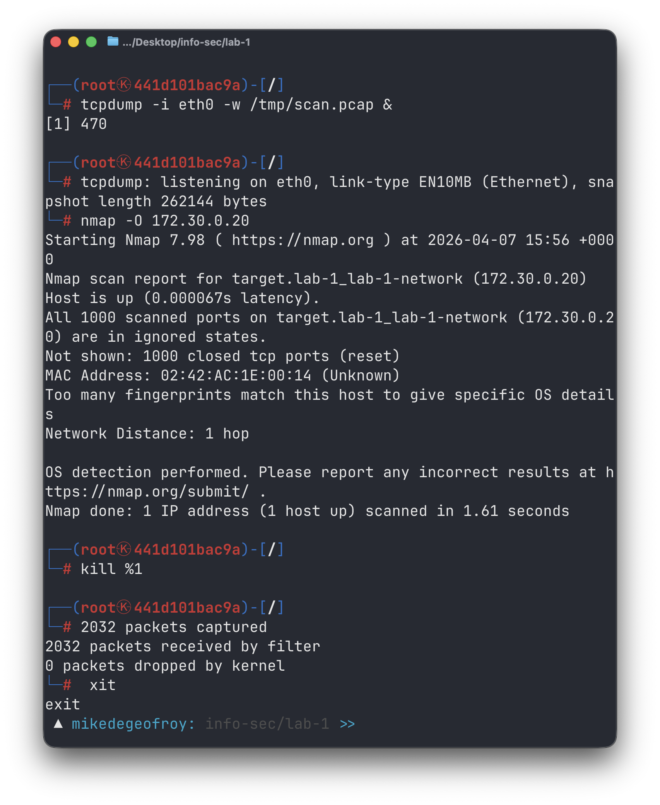
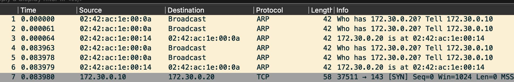
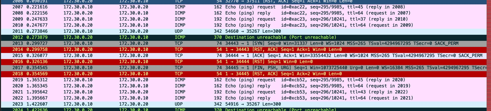
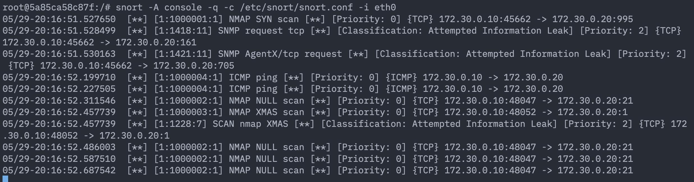
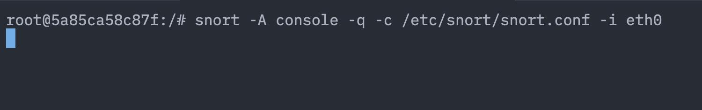

# Labwork 1
Де Джофрой Мишель М3407

## 0. Окружение

Поднял в докере сеть lab-1-network, в ней 2 контейнера

Attacker - образ кали линукса с nmap и tcpdump
Target - бубунта со snort, ssh, aparche2, vsftpd (чтобы nmap-у было что посмотреть)

см. [docker compose](./docker-compose.yml)

## 1. Скан

Запкстил `tcpdump -i eth0 -w /tmp/scan.pcap &` в фоновом режиме. Запустил `nmap -O 172.30.0.20`. Завершил принудительно `tcpdump`. И скопировал в текущую директорию. `docker cp attacker:/tmp/scan.pcap ./scan.pcap`.



## 2. Открываем дамп в Wireshark

Изначально видны ARP для получения MAC-адреса цели. Запрашиваем подтверждение что жертва существует в сети и отвечает 



Потом выполняем проверку open/closed портов для OS Detection. (Для детектирования OS нам нужен хотя бы 1 закрытый и 1 открытый порт)


Замечаем TCP SYN пробы на разные порты. Ищеться как минимум 1 порт, чтобы провести ОС Detection.



Замечаем ICMP эхо запросы и TCP пакеты

## 3. Как nmap определяет ОС

Определение OC происходит вот так:

Nmap шлёт целе пробы (TCP, UDP, ICMP) и смотрит как её стек на них отвечает. Каждая ОС отвечает чуток по-своему — по этим ответам (TTL, размер окна, флаги, IP ID и т.д.) nmap собирает "отпечаток" и сравнивает его со своей базой, выдавая самое близкое совпадение. Для этого нужен хотя бы 1 открытый и 1 закрытый порт.

## 4. Настройка snort и написание сигнатур для определения аттак

Ставлю snort на target и прописываю свою сеть как `HOME_NET`:

```bash
apt-get install -y snort
# в /etc/snort/snort.conf
ipvar HOME_NET 172.30.0.0/24
```

Свои правила пишу в `/etc/snort/rules/local.rules`. Сканер палится необычными пакетами, так что ловим их по флагам и по количеству:

```
# куча SYN с одного ip за короткое время = SYN скан
alert tcp any any -> $HOME_NET any (msg:"NMAP SYN scan"; flags:S; threshold:type both, track by_src, count 20, seconds 5; sid:1000001; rev:1;)

# пакет вообще без флагов = NULL скан
alert tcp any any -> $HOME_NET any (msg:"NMAP NULL scan"; flags:0; sid:1000002; rev:1;)

# FIN+PSH+URG = XMAS скан (такие же кривые пакеты шлёт OS detection)
alert tcp any any -> $HOME_NET any (msg:"NMAP XMAS scan"; flags:FPU; sid:1000003; rev:1;)

# nmap при OS detection шлёт ICMP echo с кодом 9 (обычный ping шлёт код 0)
alert icmp any any -> $HOME_NET any (msg:"NMAP ICMP OS probe"; itype:8; icode:9; sid:1000004; rev:2;)
```

Запускаю snort с выводом алертов в консоль:

```bash
snort -A console -q -c /etc/snort/snort.conf -i eth0
```

Теперь когда с attacker-а снова запускаю `nmap -O 172.30.0.20`, snort палит скан и сыпет алертами:



## 5. Проверить, что snort не срабатывает на обычный трафик

С attacker-а гоняю обычный трафик на target:

```bash
ping target
curl http://target
```



Snort молчит — правила заточены под аномалии (пачка SYN, кривые флаги, ICMP с кодом 9), а нормальные пакеты под них не подходят.

Был нюанс: первая версия ICMP-правила (просто `itype:8`) ловила и обычный `ping`, потому что ping — это и есть ICMP echo request, и по типу его от nmap никак не отличить. Добавил `icode:9` (nmap в OS detection шлёт echo с кодом 9, а обычный ping — с кодом 0).

## 6. Ответы на вопросы

1. В чём разница между активным и пассивным сканированием сети?

Ответ: при активном сканировании сети человек сам генерирует трафик и сканирует его, а при пассивном сканировании трафик генерируется сам по себе, а человек сканирует его.

2. Почему Snort может давать ложные срабатывания? Как это исправить?

Ответ:
- Нестандартный трафик (анализ логов)
- Неправильная настройка правил или их полное отсутствие (можно исправить правильной настройкой)

3. Какие   техники  маскировки   используют   злоумышленники,   чтобы   скрыть  Nmap-сканирование?

Ответ:
- Регулировка скорости отправки пакетов (например, сканируем всего 1 порт в час)
- Добавление трафик большого количества пакетов с фальшивых ip

4. Как работает Wireshark при анализе сетевого трафика?

Ответ:
Переводит адаптер в режим прослушивания, перехватывает все пакеты в выбранном сегменте сети, а потом конвертирует трафик в вид, понятный человеку и который можно анализировать

5. Какие основные принципы работы систем обнаружения вторжений (IDS)?

Ответ:
Основной принцип работы - анализ трафика и активности в сети на предмет потенциальных угроз (сравнивает характеристики трафика с базой известных сигнатур атак)

6. Какие различия между IDS (Intrusion Detection System) и IPS (Intrusion Prevention System)? В каком случае применяются данные средства?

Если кратко, то IDS только уведомляет об угрозе, а IPS способна блокировать угрозы автоматически

7. В каких случаях целесообразно использовать разрешённые   списки (whitelisting) вместо IDS/IPS?

Когда мы находимся в какой-то закрытой/понятной нам среде, где четко знаем что и как происходит. (Запрещать все, что не разрешено эффективнее, чем разрешать все, что не запрещено)

8. Какие методы обнаружения порт-сканирования используются в системах защиты сети?

Ответ:

Анализ трафика - можем увидеть большое количество SYN/ACK пакетов от отдного IP, можем увидеть сканирование закрытых портов, сравнение с уже известными сигнатурами

9. В чём разница между signature-based и anomaly-based методами обнаружения атак?

signature-based - используют уже известные и типовые виды атак, эффективны против известных угроз, имеют высокую точность и низкий уровень ложных срабатываний

anomaly-based - подход направленный на выявление отклонения от нормального трафика

10. Как можно снизить количество ложных срабатываний в Snort и других системах IDS?

За счет настройки параметров, оптимизации правил, фильтрации трафика и анализа результатов

11. Чем   пассивное   сканирование   сети   отличается   от   активного   с   точки   зрения безопасности? Активное сканирование может спровоцировать защиту/блокировку, создать шум, а иногда и повлиять на слабые устройства. Пассивное же сканирование не раскрывает себя и не трогает системы

12. Какие техники использует маскировочное (stealth) сканирование Nmap?
- SYN сканирование
- Сканирование с подставными адресами 
- использование фрагментированных пакетов


13. Как работают и в чём отличие SYN Scan, FIN Scan, NULL Scan?
SYN - отправляет SYN-пакет и ожидает SYN-ACK или RST, после чего разрывает сессию
FIN - отправляет пакет с флагом завершения (FIN) без установленного соединения, открытый порт игнорирует пакет, а закрытый отвечает RST
NULL - отправляет пакет без TCP флагов, открытый порт игнорирует пакет, закрытый отвечает RST

14. Как можно обнаружить и предотвратить сканирование сети злоумышленником?
Можно обнаружить путем анализа трафика, использования системы обнаружения вторжения (IDS/IPS)
Предотвратить можно путем настройки правил фильтрации, блокировать адреса при выявлении подозрительной активности
