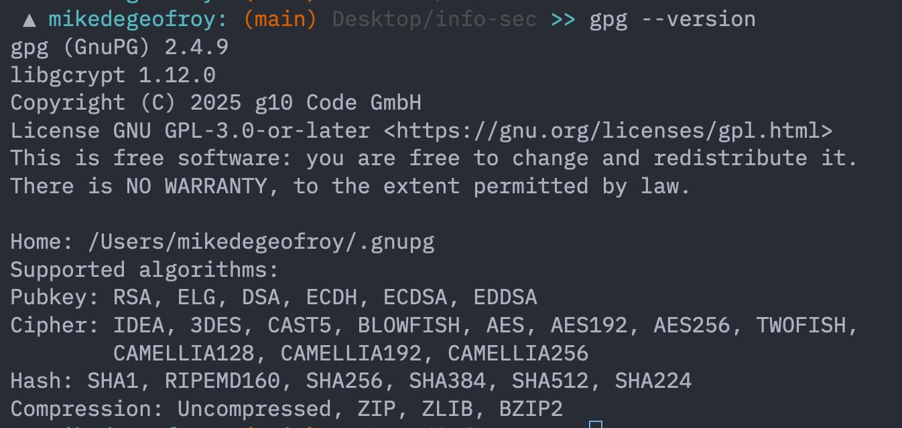
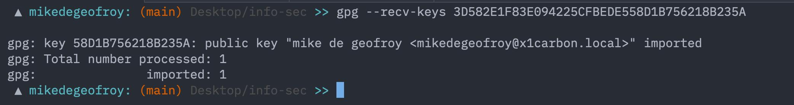
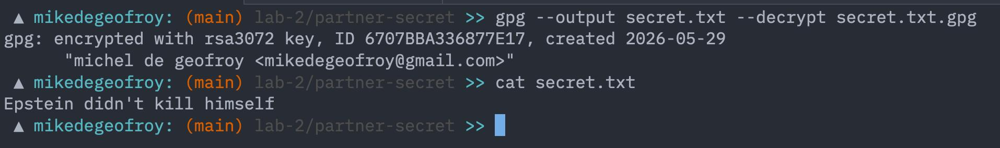
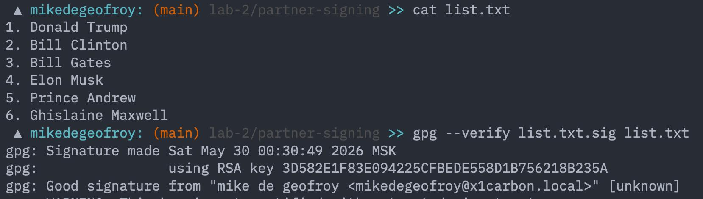
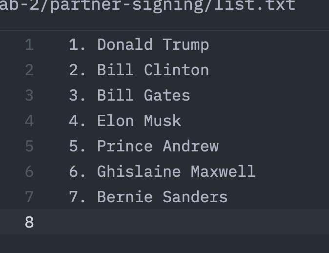
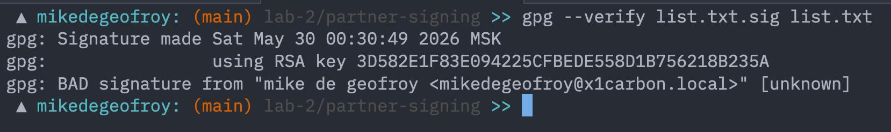

# Labwork 2
де Джофрой Мишель M3407

## 0. Окружение

Проверить, что gpg готовы.

```
gpg --version
```



Вписал в `.gnupg/dirmngr.conf` keyserver.

## 1. Создаем keypair

```gpg --full-generate-key```

Далее прошел все шаги интерактивного терминала, и отправляю свой ключ `EF85C9A6EC0B04FFD6D03995CACBF34C40987EAB` серверу.

```
gpg --send-keys EF85C9A6EC0B04FFD6D03995CACBF34C40987EAB
```

## 2. Получаем ключ от коллеги

Так как я один, чтобы лучше понять как это работает, я повторил эти шаги на своем x1carbon и импортировал публичный ключ.

```
// на x1carbon
gpg --keyserver hkps://keyserver.ubuntu.com --send-key 3D582E1F83E094225CFBEDE558D1B756218B235A
```

```
// на моем устройстве
gpg --recv-keys 3D582E1F83E094225CFBEDE558D1B756218B235A
```



Проверяю, что ключ появился в связке:

```
gpg --list-keys
```

## 3. Зашифрованный обмен

Создаю секретное сообщение и шифрую публичным ключом второго устройства:

```
echo "This is a secret message for the lab exercise." > secret.txt
gpg --output secret.txt.gpg --encrypt --recipient mikedegeofroy@x1carbon.local secret.txt
```

Отправил `secret.txt.gpg` партнёру. В ответ получил зашифрованный файл и расшифровал своим приватным ключом (gpg спросил passphrase):

```
gpg --output secret.txt --decrypt secret.txt.gpg
```

В `partner-secret/secret.txt` лежит исходное сообщение партнёра.



## 4. Цифровые подписи

### 4a. Подписываю файл со списком курсов:

Создал файл `my-signing/courses.txt` и подписал его

```
gpg --output courses.txt.sig --detach-sign courses.txt
```

Отправил партнёру оба файла — `courses.txt` и `courses.txt.sig`.

### 4b. Проверяю подпись партнёра на его файле:

```
gpg --verify list.txt.sig list.txt
```

Вывод — `Good signature from "Partner Name mikedegeofroy@x1carbon.local"`. Подпись валидная.



### 4c. Тест на подмену. Дописываю в файл лишнюю строку и снова проверяю подпись:

```
gpg --verify list.txt.sig list.txt
```

Вывод — `BAD signature`. То есть любое изменение содержимого после подписания ломает проверку — это и есть смысл цифровой подписи.





## 5. Ответы на вопросы

1. **Симметричное vs асимметричное шифрование?**

Симметричное — один общий секретный ключ и для шифрования, и для расшифрования (AES, ChaCha20). Быстро, но нужно как-то безопасно передать ключ.
Асимметричное — пара ключей: публичным шифруют, приватным расшифровывают (RSA, ECC). Медленнее, но решает проблему обмена ключами.

2. **Каким ключом шифруют файлы?**

Публичным ключом получателя. Расшифровать сможет только он своим приватным.

3. **Каким ключом подписывают файлы?**

Своим приватным ключом. Остальные проверяют подпись твоим публичным.

4. **Какие атаки на PGP-ключи существуют?**

- Key poisoning — заливают на keyserver кучу фальшивых подписей на ключ, ломают связку
- Кража приватного ключа (если passphrase слабый)
- MITM при обмене ключами (если не сверяли fingerprint лично)
- EFAIL — атаки на почтовые клиенты, которые автоматически расшифровывают письма

5. **Можно ли изменить или отозвать цифровую подпись после подписания?**

Изменить — нельзя. Подпись это криптографический хеш документа, зашифрованный приватным ключом, его нельзя «отредактировать». Отозвать можно сам ключ (revocation certificate), но конкретная подпись остаётся неизменной.

6. **Как работают keyserver-ы?**

Хранят и раздают публичные ключи. Залить может кто угодно — поэтому keyserver не гарантирует, что ключ принадлежит конкретному человеку, он гарантирует только доступность. Поэтому fingerprint всегда нужно сверять отдельным каналом.

7. **Какие алгоритмы подписей используются в PGP?**

- RSA — старый, проверенный, нужны большие ключи (3072+ бит)
- DSA — legacy, ограничен по размерам ключей, постепенно уходит
- ECDSA (nistp256 и т.п.) — короче ключи, быстрее
- EdDSA (Ed25519) — самый быстрый, самые короткие подписи, сейчас по умолчанию рекомендуется для новых ключей
