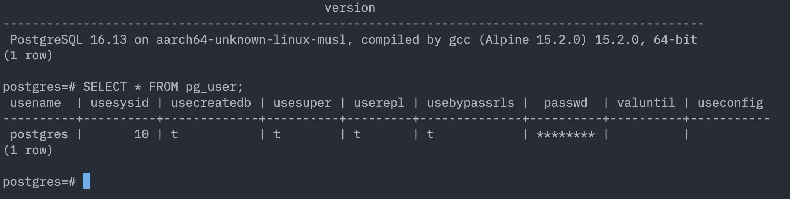
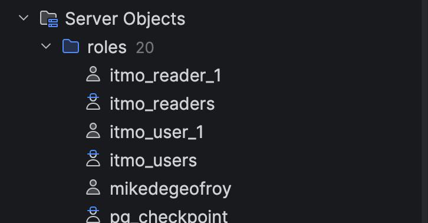
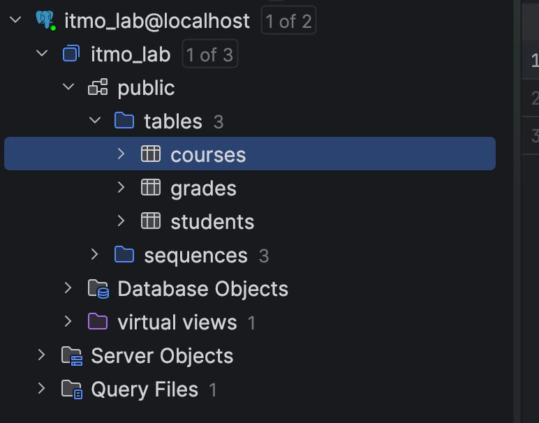
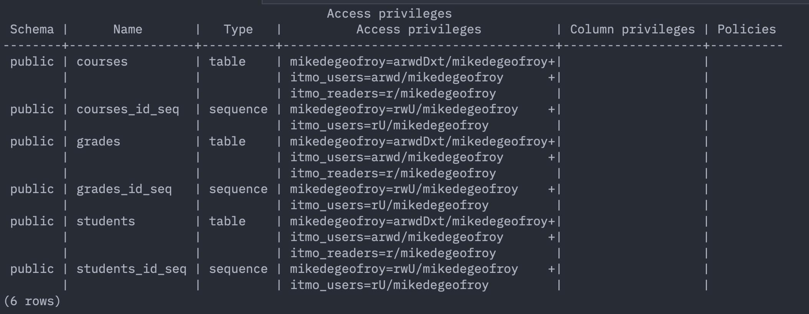
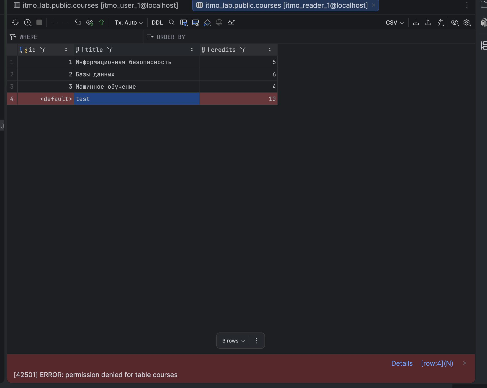
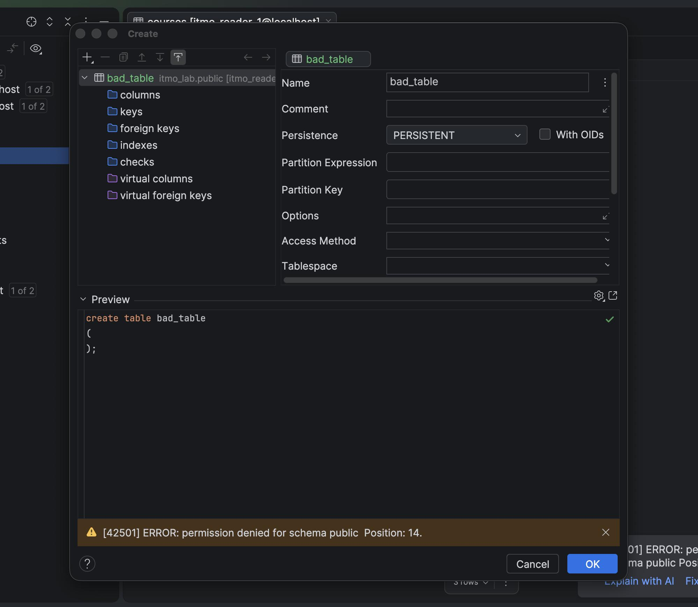

# Labwork 3 — Ролевая модель в PostgreSQL
де Джофрой Мишель M3407

Поднял PostgreSQL в докере, все шаги делаю через `docker compose up -d` и скрипты из папки `sql/`.

## 0. Окружение

`docker-compose.yml` поднимает PostgreSQL 16 на порту 5433 (5432 занят другим проектом). Данные хранятся прямо в проекте (`./pgdata`), а папка `sql/` примонтирована в контейнер как `/sql` — скрипты запускаю оттуда, без `docker cp`.

```
docker compose up -d
```



## 1. Создание ролей

Делаю две группы без логина и по пользователю в каждой. `sql/01_roles.sql`:

```sql
CREATE ROLE mikedegeofroy WITH LOGIN PASSWORD 'flowerpower' CREATEDB INHERIT;

CREATE ROLE itmo_users   NOLOGIN NOCREATEDB NOCREATEROLE INHERIT;
CREATE ROLE itmo_readers NOLOGIN NOCREATEDB NOCREATEROLE INHERIT;

CREATE ROLE itmo_user_1   WITH LOGIN PASSWORD 'user1_pass'   INHERIT;
CREATE ROLE itmo_reader_1 WITH LOGIN PASSWORD 'reader1_pass' INHERIT;

GRANT itmo_users   TO itmo_user_1;
GRANT itmo_readers TO itmo_reader_1;
```

Применяю от postgres:

```
psql -d postgres -f /sql/01_roles.sql
```

Группы без LOGIN, пользователи наследуют их права через `INHERIT`.




## 2. Создание БД и таблиц

Создаю базу с владельцем — своей личной ролью (`sql/02_database.sql`):

```sql
CREATE DATABASE itmo_lab OWNER mikedegeofroy;
```

Дальше под `mikedegeofroy` создаю три таблицы (студенты, курсы, оценки) и заливаю тестовые данные (`sql/03_schema.sql`):

```sql
CREATE TABLE students (
    id         serial PRIMARY KEY,
    full_name  text   NOT NULL,
    isu        int    UNIQUE NOT NULL,
    group_code text   NOT NULL
);

CREATE TABLE courses (
    id      serial PRIMARY KEY,
    title   text   NOT NULL,
    credits int    NOT NULL CHECK (credits > 0)
);

CREATE TABLE grades (
    id         serial PRIMARY KEY,
    student_id int REFERENCES students(id) ON DELETE CASCADE,
    course_id  int REFERENCES courses(id)  ON DELETE CASCADE,
    grade      int NOT NULL CHECK (grade BETWEEN 0 AND 100)
);
-- + INSERT тестовых данных
```

Важно применять под своей ролью, а не от postgres — тогда владельцем таблиц будет студент:



## 3. Выдача прав

Под `mikedegeofroy` раздаю права группам (`sql/04_grants.sql`): `itmo_users` — чтение/запись, `itmo_readers` — только чтение.

```sql
GRANT USAGE ON SCHEMA public TO itmo_users, itmo_readers;

GRANT SELECT, INSERT, UPDATE, DELETE
    ON ALL TABLES IN SCHEMA public TO itmo_users;

GRANT USAGE, SELECT
    ON ALL SEQUENCES IN SCHEMA public TO itmo_users;

GRANT SELECT
    ON ALL TABLES IN SCHEMA public TO itmo_readers;
```

Проверяю через `\CONNECT itmo_lab \dp` — у `itmo_users` стоит `arwd`, у `itmo_readers` только `r`:



(`a=INSERT, r=SELECT, w=UPDATE, d=DELETE`)

## 4. Проверка прав

### 4a. itmo_user_1

SELECT, INSERT, UPDATE, DELETE — всё работает. А вот создать таблицу не даёт:


Права на создание объектов не выдавал — значит нельзя.

### 4b. itmo_reader_1

SELECT работает, а INSERT/UPDATE/DELETE и CREATE — отказ:

INSERT — отказ:



CREATE TABLE — отказ:



Ридер только читает. Ролевая модель работает как надо.

## 5. Ответы на вопросы

**1. Кто такой владелец БД, чем отличается от суперпользователя?**

Владелец (`OWNER`) — хозяин конкретной базы/объекта, внутри неё может всё (менять, дропать, раздавать гранты), но за её пределами обычная роль. Суперпользователь (`SUPERUSER`) — это «root» всего кластера: обходит вообще все проверки прав и RLS, может создавать роли и читать любую БД. Идея в том, что приложение работает от владельца, а суперюзер нужен только для администрирования.

**2. Какие механизмы безопасности есть в PostgreSQL?**

- аутентификация в `pg_hba.conf` (scram-sha-256, клиентские сертификаты и т.д.)
- TLS на соединении
- роли и GRANT/REVOKE на уровне БД/схемы/таблицы/колонки
- Row-Level Security (политики на строки)
- аудит (`log_connections`, расширение `pgaudit`)

**3. Как организовать многоуровневое разграничение доступа?**

Слоями, чтобы пробой одного не давал доступ сразу: сеть (порт не наружу, VPN), аутентификация (scram/сертификаты), роли по группам, гранты на конкретные таблицы/колонки, RLS на строки, маскирование чувствительных полей через `VIEW`, шифрование (TLS, `pgcrypto`) и аудит.

**4. Плюсы ролевой модели перед классической user-based?**

- нет деления на users и groups — всё это роли, любая может включать в себя другие
- наследование: поменял грант на группе — поменялось у всех её членов
- гранты выдаём группе, а не каждому человеку — уволился сотрудник, просто убрал из группы
- роли общие на весь кластер

В лабе это видно: `itmo_user_1` лично ни одного гранта не получил — все права приходят от `itmo_users`.

**5. Как защитить PostgreSQL от перебора паролей?**

- не открывать порт наружу, доступ через VPN/bastion
- `scram-sha-256` вместо `md5`
- сильные пароли или вообще сертификаты вместо паролей
- `CONNECTION LIMIT` на роль, `VALID UNTIL` для временных доступов
- fail2ban по логам неудачных входов, расширение `auth_delay`

**6. Меры при передаче конфиденциальных данных между БД?**

- канал только по TLS (`sslmode=verify-full`)
- отдельная сервисная роль с минимальными правами
- шифрование самого чувствительного на уровне поля (`pgcrypto`)
- дампы шифровать (GPG/age) и удалять промежуточные файлы
- аудит обеих сторон: кто что выгрузил/загрузил
