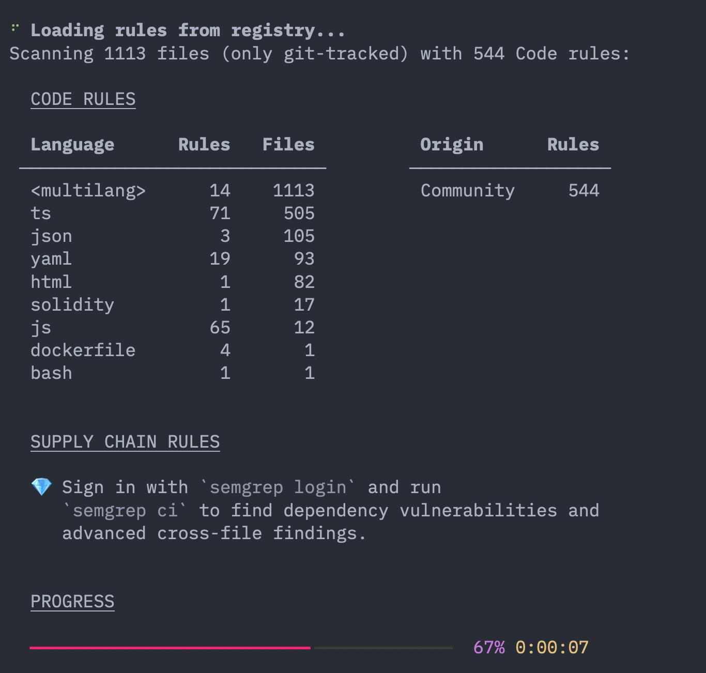
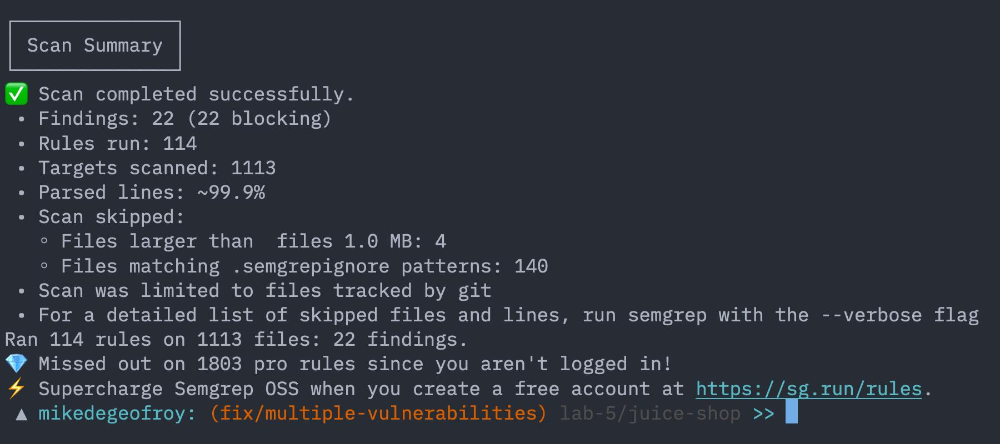

# Labwork 5 — Анализ кода на уязвимости (SAST & DAST)
де Джофрой Мишель М3407

Цель в обоих заданиях — OWASP Juice Shop (TypeScript / Node / Angular), нарочно дырявое приложение. Сначала прогнал по нему статику (Semgrep), потом динамику (ZAP).

## 1. Статический анализ (SAST)

Поставил semgrep через pipx, также, заметил что ментейнер juice-box еле еле как отмахивается от огромного количества пулл реквестов, которые он моментально закрывает как спам, и в контрибуциях четко написано, что так делать не надо. Поэтому я сделал форк репозитория к себе, и продолжил работу там. Склонировал исходники Juice Shop и прогнал по ним набор правил OWASP Top 10:

```bash
pipx install semgrep
git clone https://github.com/mikedegeofroy/juice-shop.git
cd juice-shop
semgrep scan --config "p/owasp-top-ten" --text --output ../semgrep-report.txt
```





Просканировал 1113 файлов, получил 22 находки.

Список уязвимостей, которые были найдены:

- SQL Injection: `routes/login.ts`, `routes/search.ts`, `data/static/codefixes/*`
- Path Traversal (уязвимость, при которой можно заставить приложение читать файлы вне разрешённой директории): `routes/fileServer.ts`, `routes/keyServer.ts`, `routes/logfileServer.ts`, `routes/quarantineServer.ts`
- Open Redirect (редирект на произвольный URL из пользовательского ввода): `routes/redirect.ts`
- `eval` (риск выполнения произвольного кода) в `routes/userProfile.ts`
- Directory listing в `server.ts` (`serveIndex(...)` на `/ftp`, `/.well-known`, `/encryptionkeys`, `/support/logs`)
- Hardcoded JWT secret в `lib/insecurity.ts`
- Shell-injection в GitHub Actions (`${{ github.* }}` прямо в `run:`) — 3 файла в `.github/workflows/`

Как можно исправить:

- SQL Injection — не собирать SQL строками из пользовательского ввода, использовать параметризацию и ORM вместо сырых запросов (в Sequelize — билдер `Model.findAll({ where })` или `query(sql, { replacements })`)
- Path Traversal — разрешать только файлы из вайтлиста и проверять, что путь остаётся внутри базовой директории
- Open Redirect — разрешать только относительные пути внутри приложения либо домены из allowlist, иначе отдавать 400
- `eval` — использовать безопасный парсер с вайтлистом операций, а лучше убрать вовсе
- Directory listing — закрыть доступ к важным каталогам и добавить авторизацию
- Hardcoded secret — вынести ключ в env-файл или использовать Vault
- GitHub Actions — не интерполировать `${{ github.* }}` прямо в `run:`, прокидывать через `env:` и брать `"$VAR"` в кавычках

PR с исправлением Open Redirect и одного Path Traversal сделал в свой форк (в публичный учебный апстрим не пушу).
https://github.com/mikedegeofroy/juice-shop/pull/1

## 2. Динамический анализ (DAST)

То же приложение, но уже запущенное — поднял Juice Shop в докере и натравил на него OWASP ZAP (baseline-скан тоже в контейнере):

```bash
docker run --rm -d --name juice-shop-lab5 -p 13000:3000 bkimminich/juice-shop
curl -I http://localhost:13000/

docker run --rm -v $PWD/lab-5:/zap/wrk:rw \
  ghcr.io/zaproxy/zaproxy:stable \
  zap-baseline.py -t http://host.docker.internal:13000 -r zap-report.html -J zap-report.json
```

Baseline-скан пассивный — он ничего не ломает, а смотрит на ответы и заголовки, так что почти вся выдача про конфиг. Что нашёл (заголовки видно прямо в `curl -i http://localhost:13000/`):

- Нет CSP, слабый `X-Frame-Options` — страницу можно засунуть в iframe, отсюда кликджекинг. Лечится заголовком `Content-Security-Policy: default-src 'self'; frame-ancestors 'none'`.
- Сервер палит стек в `X-Powered-By` / `Server` — сразу видно, что внутри Express, проще подобрать готовый эксплойт. Убирается через `app.disable('x-powered-by')` или просто `helmet()`.
- Cookie на сессии/JWT без `Secure` и `HttpOnly` — такую можно увести через XSS или перехватить по http. Ставлю флаги: `res.cookie(name, val, { httpOnly: true, secure: true, sameSite: 'strict' })`.
- CORS открыт в `*` — любой чужой сайт может дёргать API от имени юзера. Вместо звёздочки — список доверенных origin, особенно на эндпоинтах с авторизацией.
- Старые JS-зависимости фронта — ZAP узнаёт их по известным CVE. Тут банально: обновить пакеты, `npm audit fix`.

## Ответы на дополнительные вопросы

**1. Что лучше всего ловит SAST?**
То, что видно прямо в коде и детерминировано: инъекции (SQL/NoSQL/LDAP/Command), XSS-sink'и без экранирования, path traversal, SSRF из необработанного URL, небезопасную десериализацию, слабую крипту и хардкод секретов, в C/C++ — memory safety.

**2. Что можно найти только через DAST?**
То, что вылезает только в рантайме: ошибки конфигурации сервера, кривые security-заголовки, слабый TLS, неинвалидируемые сессии, IDOR на живых эндпоинтах, отсутствие rate limiting, дыры в бизнес-логике и в реально развёрнутых зависимостях.

**3. Что запускать первым?**
Сначала SAST — не нужно поднимать окружение, работает быстрее, ловит проблемы прямо в коде, а чинить в коммите дешевле, чем после деплоя. DAST следом — добирает то, что статика принципиально не видит.

**4. Когда SAST даёт ложные срабатывания?**
Когда смотрит на фрагмент без контекста; на динамике языка (reflection, monkey-patching, runtime DI); на хитрых taint-цепочках с кастомными санитайзерами, которые движок не узнаёт; на слишком общих правилах.

**5. Как не накосячить с настройкой DAST?**
Чётко зафиксировать область (URL/API spec), настроить аутентификацию и хранение сессии, прогнать spider перед атаками, сканировать staging (не прод), находки проверять руками перед заведением багов.

**6. Ограничения SAST против DAST?**
Не видит конфигурацию сервера и версии зависимостей в рантайме, не понимает бизнес-логику с последовательностью действий, для компилируемых языков нужна корректная сборка, плохо дружит с reflection/DI.

**7. Как ловить то, что не видят ни SAST, ни DAST?**
Комбинировать: SCA (CVE в зависимостях), IAST/RASP, сканирование IaC и контейнеров, ручной code review и пентест на бизнес-логику, threat modelling на этапе дизайна.

**8. Open-source инструменты SAST и DAST, в чём разница?**
SAST: Semgrep, Brakeman (Rails), Bandit (Python), gosec (Go), CodeQL. DAST: OWASP ZAP, Nikto, SQLMap, Nuclei. SAST читает код, DAST атакует запущенное приложение — разные классы, друг друга не заменяют.

**9. Как часто гонять в CI/CD?**
SAST — на каждый PR (быстрый профиль), полный на merge в main и перед релизом (блокирующий). DAST — после деплоя в staging (smoke), полный по ночам, перед релизом обязательно.

**10. Интерпретируемые vs компилируемые языки с точки зрения анализа?**
У интерпретируемых (JS/Python/PHP) много динамики (`eval`, monkey-patching), call graph неточный — у SAST больше ложных срабатываний. У компилируемых (Java/C#/Go) есть типы и байт-код, точность выше; для C/C++ важны memory-safety баги, которые DAST ловит плохо, а SAST/фаззинг — хорошо.

**11. Как использовать результаты DAST для усиления защиты?**
Приоритизировать критику (RCE/SQLi/auth-bypass), править конфиги (заголовки, TLS), писать виртуальные патчи в WAF, добивать регрессионные тесты по найденным сценариям, показывать команде реальные эксплойты.

**12. Зачем учитывать контекст при чтении отчёта SAST?**
Без контекста он либо шумит (ругается на безопасный параметризованный запрос из-за сигнатуры), либо пропускает реальный баг (taint через несколько функций). Контекст (откуда данные, кто их санитизирует, открыт ли эндпоинт) позволяет отсеять FP и заняться настоящими дырами.

**13. Можно ли полностью автоматизировать анализ безопасности?**
Нет. Автоматика отлично ловит технику и регрессии (инъекции, конфиги, известные CVE), но бизнес-логика, цепочки IDOR, манипуляции состоянием и отсев false positive всё равно требуют ручного аудита.
