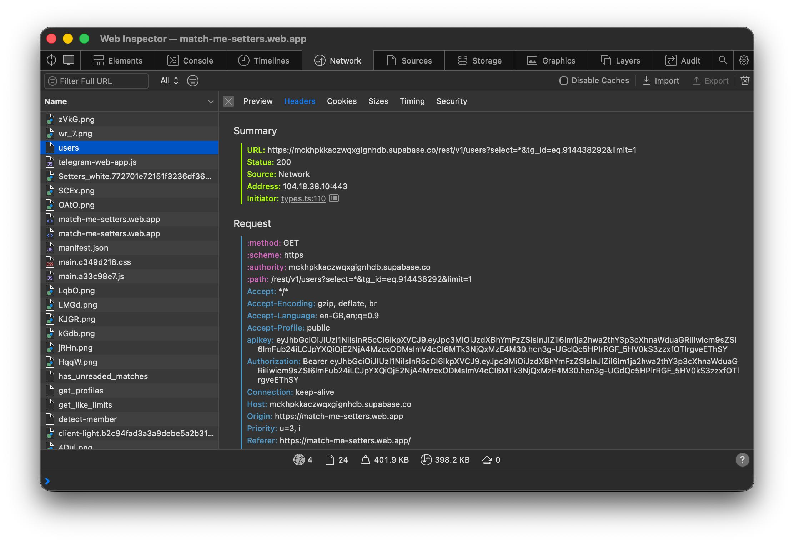
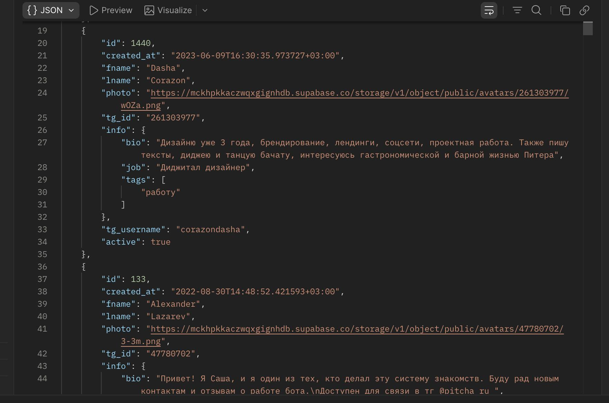
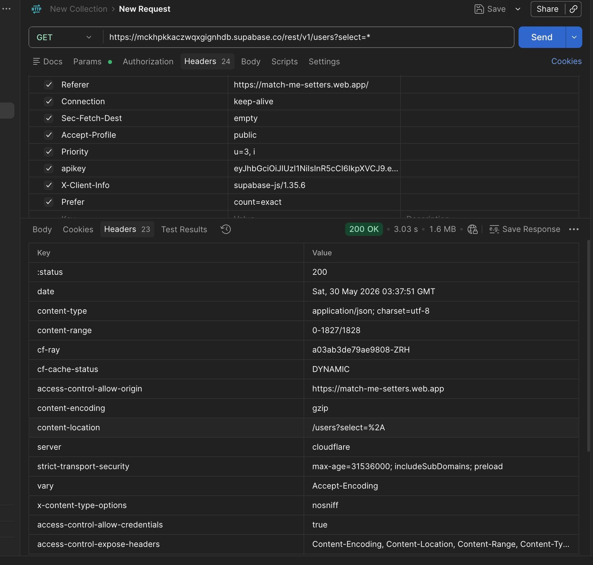

# Bonus Labwork 1

Пару месяцев назад я натнулся на телеграм бот setters media. Идея простая: тиндер для нетворкинга. Попадаются случайное количество карточек, пользователь решает ставить лайк или нет. Так вот, стало интересно как оно было сделано.

Вот пример запроса на бэк.. и.. сразу видно, что это очень плохо. 

```bash
GET https://mckhpkkaczwqxgignhdb.supabase.co/rest/v1/users?select=*&tg_id=eq.914438292&limit=1
```



Просмотор auth-токенов в запросе показывает, что токен выдается не пользователю, а один общий.. вот параметры jwt токена.

```json
{
  "iss": "supabase",
  "ref": "mckhpkkaczwqxgignhdb",
  "role": "anon",
  "iat": 1660837183,
  "exp": 1976413183
}
```

То есть токен вписан хардкодом на фронте?! С выгоранем.. внимание.. через 6 лет. Я стал смотреть, что можно подергать в api. Порывшись немного в документации supabase, стало понятно, что у ребят просто на прямую открыт data api. https://supabase.com/docs/guides/api.



То есть пользователь может спокойно смотреть, обновлять, удалять и менять данные для.. 1828 пользователей а также 176086 реакций. При этом, подпись telegram init data не проверяется -> можно зайти с чужого аккаунта зная всего лишь его tgid.


